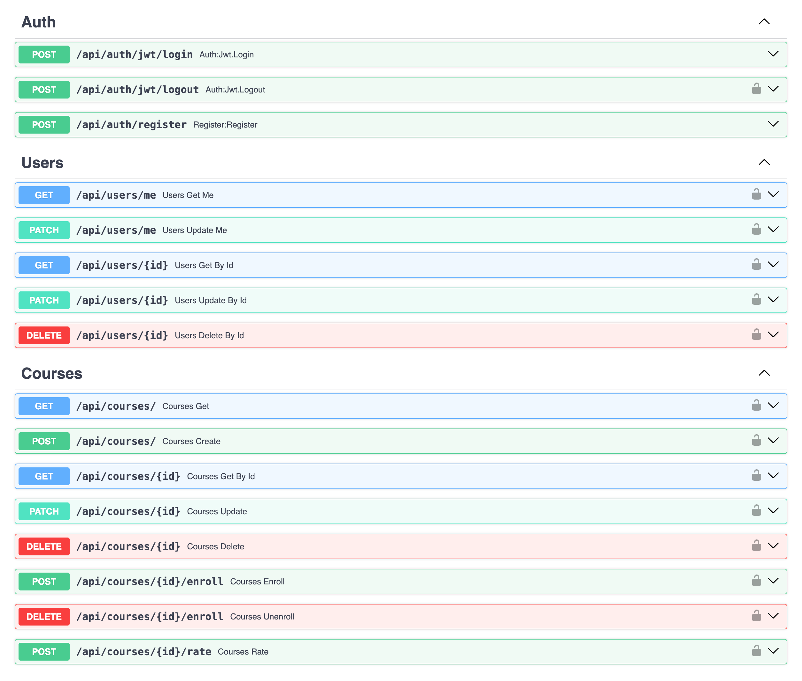
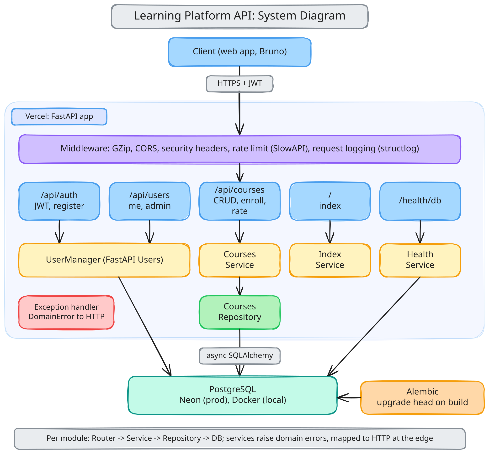
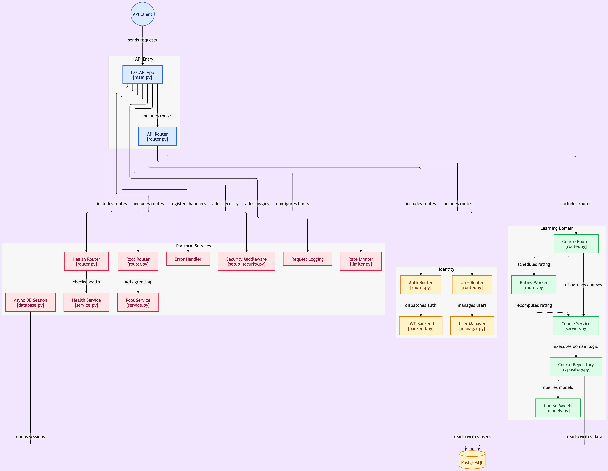
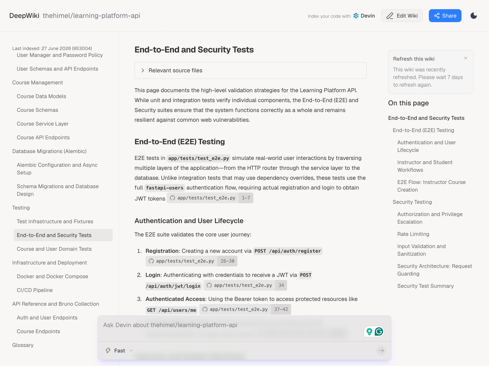

# Learning Platform API

[](https://www.python.org/)
[](https://fastapi.tiangolo.com/)
[](https://docs.pydantic.dev/)
[](https://www.sqlalchemy.org/)
[](https://alembic.sqlalchemy.org/)
[](https://www.postgresql.org/)
[](https://www.structlog.org/)
[](https://github.com/TypeError/secure)
[](https://github.com/thehimel/learning-platform-api/actions/workflows/ci.yml)
[](https://docs.astral.sh/uv/)
[](https://docs.astral.sh/ruff/)
[](https://vercel.com/)

A learning platform API built with FastAPI. Supports courses, enrollments, ratings, and role-based access (student, instructor, admin).

## Tech Stack

- Framework: FastAPI
- Database: PostgreSQL (async via asyncpg)
- ORM: SQLAlchemy 2.0 (async)
- Auth: fastapi-users (JWT)
- Rate limiting: slowapi
- Logging: structlog
- Security headers: secure

## Features

- Auth: Register, login (JWT), password update
- Users: `GET/PATCH /me`; admin CRUD for users
- Courses: CRUD, list with pagination and filters (`published`, `q` for title search)
- Enrollments: Enroll/unenroll in courses
- Ratings: Rate courses (1-5); aggregate recomputed asynchronously
- Visibility: Unauthenticated: published only; instructor: published + own unpublished; admin: all

## Project Setup

```shell
uv sync
```

Copy `.env.example` to `.env` and set `POSTGRES_USER`, `POSTGRES_PASSWORD`, `POSTGRES_DB`, `JWT_SECRET_KEY`, `AUTH_RESET_PASSWORD_TOKEN_SECRET`, and `AUTH_VERIFICATION_TOKEN_SECRET`. Generate secrets with `openssl rand -hex 32`.

```shell
cp .env.example .env
```

## Run With Docker

### Only PostgreSQL

Starts just the database, so the app runs on the host with `uv run uvicorn app.main:app --reload`.

```shell
docker compose up -d postgres
```

### App and PostgreSQL Together

```shell
docker compose up
```

### Stop the Containers

```shell
docker compose down
```

## Database Migrations

```shell
alembic upgrade head
```

## Run the App

```shell
uv run uvicorn app.main:app --reload
```

API: http://localhost:8000
Docs: http://localhost:8000/docs

## API Overview



## Run Tests

Tests use a separate database (`{postgres_db}_test`), created and migrated automatically.

```shell
pytest -v

# Parallel execution
pytest -n auto
```

## Commands

| Description | Command |
|-------------|---------|
| Install dependencies (from pyproject.toml) | `uv sync` |
| Run API (dev) | `uv run uvicorn app.main:app --reload` |
| Apply migrations | `alembic upgrade head` |
| Create migration | `alembic revision --autogenerate -m "message"` |
| Run tests | `pytest` |
| Run tests in parallel (pytest-xdist) | `pytest -n auto` |
| Run tests and drop test DB after | `pytest --drop-test-db` |
| Lint | `ruff check .` |
| Format | `ruff format .` |

See [docs/commands.md](docs/commands.md) for Docker, pre-commit, and more.

## Documentation

- [Commands](docs/commands.md): Docker, Alembic, pytest, ruff
- [DB setup](docs/config/sqlalchemy-alembic-async-setup.md): Async SQLAlchemy and Alembic
- [Auth options](docs/wiki/fastapi-auth-options.md): Why fastapi-users
- [Test types](docs/questions/test-types.md): Unit, integration, E2E
- [Test speed](docs/config/test-speed.md): pytest performance notes
- [Troubleshoot DB](docs/troubleshoot-db.md): Connection issues
- [Steps](docs/steps.md): Project build order

### System Diagram



Generated with [Excalidraw](https://excalidraw.com/)

### Component Map



Generated with [GitDiagram](https://gitdiagram.com/)

### Wiki

Explore the [detailed documentation](https://deepwiki.com/thehimel/learning-platform-api) for this project.



Generated with [DeepWiki](https://deepwiki.com/)
